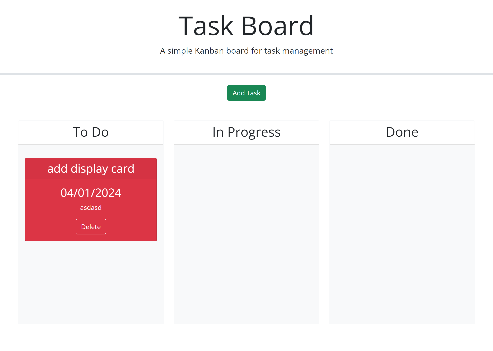

# Task Board Project

## Overview

The Task Board is a dynamic, web-based project management tool designed to help teams and individuals keep track of tasks across different stages of progress. It provides a clear visual representation of tasks categorized by their progress state: Not Yet Started, In Progress, and Completed. Each task is color-coded to easily identify deadlines and overdue tasks, enhancing productivity and time management.

## Features

- **Visual Progress Tracking**: Tasks are displayed in columns based on their progress state, allowing for easy visualization of project workflow.
- **Color-Coded Deadlines**: Tasks nearing their deadlines are highlighted in yellow, while overdue tasks are marked in red, providing immediate visual cues for priority management.
- **Task Creation**: Users can define new tasks through a modal dialog, entering essential details such as title, description, and deadline date.
- **Persistent Storage**: Task properties are saved in the browser's localStorage, ensuring data persistence across sessions.
- **Drag-and-Drop Functionality**: Tasks can be moved between progress columns through an intuitive drag-and-drop interface, with updates reflected immediately and preserved after page refreshes.
- **Task Deletion**: Tasks can be removed from the board with a simple click, decluttering the workspace and focusing on current priorities.

## Getting Started

1. **Open the Task Board**: Simply load the page in your web browser to start managing your project tasks.
2. **View Tasks**: Tasks are automatically loaded and displayed in their respective progress columns.
3. **Add a New Task**: Click the "Define New Task" button to open the modal dialog, where you can input the task's title, description, and deadline.
4. **Save Task**: After entering the task details, click the "Save" button to add the task to the board. The task will be saved to localStorage.
5. **Update Task Progress**: Drag and drop tasks between columns to update their progress state. The changes are immediately saved and will persist across page refreshes.
6. **Delete Tasks**: Click the "Delete" button on any task you wish to remove. The task will be permanently deleted from the board and localStorage.

## Persistence

The Task Board uses the browser's localStorage to save task information, ensuring that your tasks and their states are preserved even after you close or refresh the browser window.

# # Screenshots

.png>)

# # Sources

https://chat.openai.com/

https://bootcampspot.instructure.com/courses/5271/external_tools/313

https://jqueryui.com/

https://getbootstrap.com/

# # URL link to the website

https://rinjeeg.github.io/Task-Board/